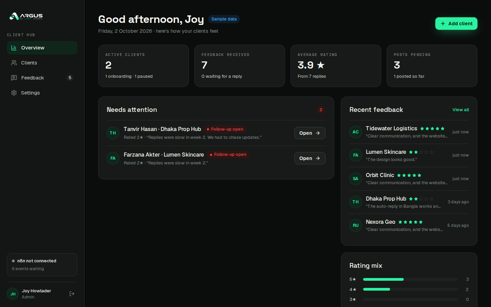

# ARGUS Client Hub

Client feedback and relationship management for **ARGUS** (argusofficial.com). It is built only for ARGUS's own clients: brand, website, AI automation, ads and content projects.

It has two parts:

| Part | URL | Who |
|---|---|---|
| **Public feedback form** | `/feedback/<personal-code>` | ARGUS clients. No login. One personal link per client. English + বাংলা. |
| **Dashboard** | `/hub` | ARGUS team (login). Clients, feedback, follow-ups, post status, settings. |

Every change is saved in Postgres first, then sent to **n8n** as a signed webhook event. n8n writes the **Google Sheet** row and sends WhatsApp/email alerts. n8n is **not connected yet**: events wait in an outbox and are delivered once it is.



---

## 1. Quick start (2 minutes, no database)

```bash
cd argus-client-hub
npm install
npm run dev
```

- Open http://localhost:3000/hub. This is **demo mode** (no `DATABASE_URL`).
- Login is pre-filled: `joy@argus.demo` / `argus-demo`.
- Sample clients and feedback are clearly marked **"Sample data"**. They are not real ARGUS clients.
- Try the form: http://localhost:3000/feedback/orbit-clinic-m2k8wd
- Style guide with every component and variant: http://localhost:3000/design
- Reset the sample data: `npm run demo:reset`, then restart.

Requirements: Node 20.9+ (tested on Node 22), npm 10.

---

## 2. Production setup (Supabase + Vercel)

1. **Create a Supabase project.**
   - Region: closest to Bangladesh, e.g. Singapore or Mumbai.
   - Copy **Project Settings → Database → Connection string → Transaction pooler** (port 6543).
2. **Run the schema:**
   ```bash
   cp .env.example .env.local     # put DATABASE_URL in it
   npm run db:migrate             # applies db/migrations/*.sql (safe to re-run)
   npm run admin:create -- --email neonemiami@gmail.com --name "Joy Howlader"
   ```
   The admin password is printed once. Change it later in **Settings → My account**.
3. **Deploy to Vercel.**
   - Import the repo and set **Root Directory = `argus-client-hub`**.
   - Set these env vars (see `.env.example`): `DATABASE_URL`, `PUBLIC_BASE_URL` (e.g. `https://feedback.argusofficial.com`), `CRON_SECRET`.
   - Optional now: `N8N_WEBHOOK_URL`, `N8N_WEBHOOK_SECRET`.
4. **Add the domain** in Vercel (e.g. `feedback.argusofficial.com`) and add the DNS record Vercel shows.
5. **Cron.** `vercel.json` runs `/api/cron/daily` at 04:00 UTC (10:00 Dhaka). Vercel sends `Authorization: Bearer $CRON_SECRET` automatically.
6. **Check it works.**
   - `GET /api/health` → `{"ok":true,"store":"postgres"}`.
   - Add a test client, open its link, send feedback, and see it on the dashboard.

> A production build **refuses to start in demo mode** unless `ALLOW_DEMO_IN_PRODUCTION=true`, so a missing `DATABASE_URL` can never silently show sample data to the team.

Other hosts work too: any Node 20 host (`npm run build && npm start`) and any Postgres 14+ (Neon, Railway, RDS…).

More detail: [docs/DEPLOY.md](docs/DEPLOY.md).

---

## 3. Connecting n8n later

No code change is needed. Two ways:

- **Dashboard → Settings → n8n + Google Sheet:**
  1. Paste the n8n webhook URL.
  2. Click **Generate a secret** and paste it into n8n.
  3. Save, then click **Send test event**.
- **Or env:** `N8N_WEBHOOK_URL` + `N8N_WEBHOOK_SECRET`. Env wins over Settings.

Events created before n8n was connected are waiting. Click **Send pending events** once, or let the cron deliver them.

Read [docs/N8N.md](docs/N8N.md) for:
- the event list,
- the JSON body,
- signature verification,
- the Google Sheet columns,
- a starter workflow you can import: [docs/n8n-starter-workflow.json](docs/n8n-starter-workflow.json).

---

## 4. Features

### Public form (`/feedback/[code]`)

- **Brand look.** Dark premium backdrop: mint glow, dot grid, ARGUS symbol watermark, circuit lines.
- **Founder note.** At the top, Joy's round photo and a short thank-you message.
- **Questions:**
  - Overall rating. This is the only required field.
  - Communication ★ and Result ★.
  - "Did well" and "Do better".
  - Recommend Yes / Maybe / No.
- **Public permission.** Off by default. When ticked, the client picks how their name is shown (Name + company / First name / Anonymous) and can add an optional photo or logo (JPG/PNG/WEBP, max 5 MB, file signature checked).
- **Language.** EN / বাংলা switch for every word. It is remembered per device, and the default comes from the client's preferred language.
- **Draft autosave.** Answers are saved in localStorage, so closing the tab never loses them.
- **Progress bar.** A small progress bar at the top.
- **Validation.** If the client sends without a rating, the stars shake and the page scrolls to them.
- **After sending:**
  - **4–5★ thank-you page:**
    - large founder photo card with tilt and float;
    - mint particle burst;
    - the summary of their answers;
    - optional "Review ARGUS on Facebook / Google" buttons (Google stays hidden until its link is set).
  - **1–3★ page:** "Joy will contact you within 24 hours", with WhatsApp and email buttons. It never asks for a review.
- **Other link states:**
  - **Already used:** single-use link, shows a friendly thank-you.
  - **Link not active:** unknown code.
- **Abuse protection.** Rate limited per IP and per code. The page is `noindex`.

### Dashboard (`/hub`)

- **Overview:**
  - KPIs with count-up: active clients, feedback received, average rating, posts pending.
  - **Needs attention:**
    - open 1–3★ follow-ups;
    - completed projects with no feedback after N days (sent, or link not sent yet);
    - n8n sync errors.
  - Recent feedback and a rating mix chart.
- **Clients:**
  - Search and status filter.
  - Table with copy / WhatsApp / email link buttons. WhatsApp opens `wa.me` with a ready message in the client's language.
  - Add client modal. After saving, a "send the link now" step appears.
  - Statuses: Onboarding / Active / Completed / Paused.
- **Client detail:**
  - Details, and the feedback link (status: Link not sent → Link sent → Opened → Answered).
  - **New link** for a new project.
  - Private notes (autosave).
  - Feedback history with "mark follow-up done".
  - Timeline, plus a contact log (call / WhatsApp / email / meeting).
  - Inline status change.
  - Delete (admin only, type-the-name confirmation).
- **Feedback:**
  - Filters: client, rating, service, post status, follow-up.
  - Detail drawer:
    - **Post status** Not for post / Pending / Posted, plus a post link (required for Posted). It is **locked when the client gave no permission**, enforced in the app *and* by a DB constraint.
    - Follow-up toggle and "Copy quote for post".
  - **Export CSV** with the same 18 columns as the Sheet. Bangla-safe, formula-injection-safe.
- **Settings (admin):**
  - n8n URL/secret, event toggles, test event, and an event log with retry.
  - Google Sheet link.
  - Notification recipients and toggles, and the reminder delay.
  - **Form branding:** upload the thank-you photo and round photo, and edit the EN/BN messages. They are live on the form instantly.
  - Review links and the public contact.
  - Team: invite members, Admin/Staff roles.
  - My account: change password.
- **Motion and accessibility:**
  - Spring page transitions, staggered rows, animated drawers/modals/toasts, focus traps and Esc to close.
  - Keyboard star rating.
  - Respects "reduce motion".
  - Mobile menu.
  - Bangladesh time zone everywhere.

---

## 5. Architecture

```
src/
  app/
    feedback/[code]/     public form page + its server actions (submit, mark opened)
    hub/login/           login page
    hub/(app)/           dashboard pages (layout = auth gate + sidebar, template = page transition)
    hub/actions/         dashboard server actions (auth, clients, feedback, settings, team)
    api/                 files (uploaded images), export CSV, cron (daily, outbox), health
    design/              living style guide (dev + demo only)
  components/
    ui/                  design system primitives (Button, Pill, Stars, Field, Overlay, Toast…)
    brand/               Logo, Backdrop, FounderPhoto
    form/                public form (FeedbackExperience, Outcome, LangSwitch, PhotoPicker)
    hub/                 dashboard components
  lib/
    domain/              types + labels (statuses, services, colors)
    data/                Store interface → pg-store (Postgres) | demo-store (JSON) + seed
    services/            business logic: clients, feedback, settings, team, insights, files
    integrations/outbox  n8n outbox: enqueue → deliver (HMAC signed) → retry with backoff
    auth/                scrypt passwords, DB sessions (sha256 token), guards
    i18n/form.ts         every EN/BN string of the public form
db/migrations/           SQL schema (run with npm run db:migrate)
scripts/                 migrate, create-admin, demo-reset
proxy.ts                 fast redirect to /hub/login when there is no session cookie
```

**Rules that keep it safe:**

- **Only the server touches the database.** The `DATABASE_URL` connection string is server-only. The browser never gets a database key. RLS is on with no policies, so Supabase's public API exposes nothing.
- **Every server action re-checks the session** (`assertMember`). Admin-only actions use `assertMember({ admin: true })`. The proxy is only a fast path.
- **Inputs are validated with zod.** Action results are shaped for the UI (`ActionResult`), never raw rows.
- **Passwords and sessions.**
  - Passwords use scrypt.
  - Session cookies are random 32-byte tokens; only their sha256 is stored.
  - Cookies are httpOnly, SameSite=Lax, and Secure in prod.
  - Login is rate-limited and timing-safe.
- **Integrations never break the main flow.** `emit()` writes to the outbox and tries once. Failures wait with exponential backoff (8 attempts). The DB stays the source of truth.

**Why not write to Google Sheets directly?**
- It would need a Google key on the server for every request.
- It is slow.
- Sheet downtime would lose data.

The outbox + n8n keeps the app fast and loses nothing.

---

## 6. Scripts

| Command | What |
|---|---|
| `npm run dev` | Dev server (demo mode without `DATABASE_URL`) |
| `npm run build` / `npm start` | Production build / server |
| `npm run typecheck` / `npm run lint` | TypeScript / ESLint |
| `npm run db:migrate` | Apply SQL migrations (idempotent) |
| `npm run admin:create -- --email x@y.com [--name "…"] [--role admin\|staff] [--password …]` | Create an admin or reset a password |
| `npm run demo:reset` | Delete demo data (`.data/`) |

---

## 7. What was tested

- `typecheck`, `lint` and `next build` all pass.
- **Demo mode, end-to-end with Playwright:**
  - login (wrong and right password);
  - add client with validation errors;
  - copy/send link;
  - client answers 5★ public with logo, and 2★ in বাংলা;
  - single-use link, invalid link;
  - mark Posted (post link required);
  - private feedback locked;
  - CSV export;
  - branding photo upload;
  - invite member;
  - mobile menu;
  - logout.
- **Real Postgres 16, end-to-end** with a mock n8n webhook:
  - migrations run twice (idempotent), and `admin:create` works;
  - every event was delivered with a **valid HMAC signature**;
  - a 2★ feedback was flagged `urgent`;
  - with n8n down, events go **failed**; after n8n is back, **Send pending events** delivers them;
  - cron and export endpoints reject requests without a secret or session;
  - uploaded photos are served from Postgres.

**Not tested here** (no access from this environment):
- a live Supabase project;
- a real n8n instance and Google Sheet;
- WhatsApp sending. That is n8n's job, see docs/N8N.md.

---

## 8. Design source

- **Figma:** main ARGUS file, pages **29 (plan)**, **30 (form)** and **31 (dashboard)**. Links and node ids are in [docs/DESIGN.md](docs/DESIGN.md).
- **Screenshots** of every screen and state are in [docs/screenshots](docs/screenshots).
- **Component sheet:** `docs/screenshots/00-components-style-guide.png`, or `/design` when running locally.

## 9. Working with Claude Code

`CLAUDE.md` explains the project to Claude Code: architecture, rules, commands and the Next.js 16 notes. Start a session in this folder and ask, for example:

> "Read CLAUDE.md and docs/N8N.md, then help me connect our n8n."

Contact: Joy Howlader · WhatsApp +880 1303-364567 · neonemiami@gmail.com · https://argusofficial.com
