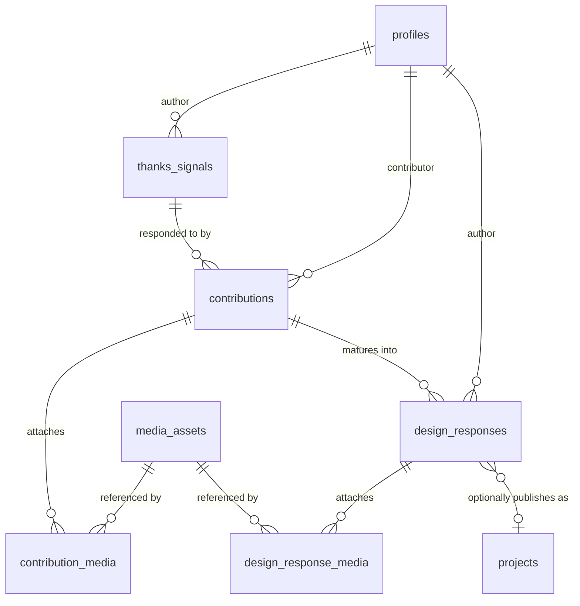

# THANKS_UX_COMMUNITY_ARCHITECTURE.md

## Phase 6A — Community Data Model & Architecture (design only)

**Status: design + migration plan, not executed.** No table in this document exists in the real database yet. `supabase/migrations/0012_thanks_ux_community.sql` is written and reviewed-ready but has not been run. Nothing in this phase touched the CMS, auth, admin, or any existing table.

---

## 1. Product concept

Thanks UX lets a real person share a small, real moment where design/UX friction affected them — not a bug report, a lived experience ("Booking a first dental appointment was confusing"). A designer or researcher can respond to that moment with a real contribution — an observation, a piece of research, a proposed direction, a prototype. A contribution can mature into a full design response, and a design response can optionally be published as a real portfolio project, using the CMS system that already exists.

```
User → ThanksSignal → Contribution → DesignResponse → (optional) Project
```

This phase designs exactly that chain, and nothing past it — no feed, no comments, no reactions, no notifications.

---

## 2. Entity relationship diagram



Five new tables. `profiles`, `media_assets`, and `projects` are existing tables (Phase 3B/4C), referenced by foreign key only — none of them gain, lose, or change a single column.

---

## 3. Table definitions

### `thanks_signals`
| Column | Type | Required | Notes |
|---|---|---|---|
| `id` | uuid PK | — | |
| `author_id` | uuid → `profiles(id)` | **required** | who submitted it |
| `title` | text | **required** | |
| `description` | text | **required** | the actual problem/moment, in the author's words |
| `category` | text | optional | free text, same convention as `projects.category` — no fixed enum, so a new category never needs a migration |
| `context` | text | optional | situational framing ("when trying to book online at 11pm…") — deliberately free text, never a structured location field (§9) |
| `audience` | text | optional | who's affected, if the author wants to say |
| `status` | text | required, defaults `'draft'` | lifecycle, see §7 |
| `visibility` | text | required, defaults `'private'` | `'private'` \| `'public'` — controls read access independent of status |
| `created_at`/`updated_at` | timestamptz | — | |

**Not included, deliberately**: precise location, phone, or any field the brief said not to require. A `thanks_count` or similar reaction counter was considered and **not added** — that belongs to the future interaction model (§12), and adding a column for a feature not being built yet would be exactly the "invent fields unnecessarily" this phase was told to avoid.

### `contributions`
| Column | Type | Required | Notes |
|---|---|---|---|
| `id` | uuid PK | — | |
| `thanks_signal_id` | uuid → `thanks_signals(id)` | **required** | |
| `contributor_id` | uuid → `profiles(id)` | **required** | |
| `contribution_type` | text | optional | free text (e.g. "observation", "research", "solution", "prototype") |
| `explanation` | text | optional | |
| `research` | text | optional | |
| `observation` | text | optional | |
| `proposed_direction` | text | optional | |
| `prototype_url` | text | optional | |
| `figma_url` | text | optional | |
| `external_url` | text | optional | |
| `status` | text | required, defaults `'draft'` | see §10 |
| `created_at`/`updated_at` | timestamptz | — | |

Media: `contribution_media` (join table, below) — a contribution can carry zero or more.

**Cardinality**: one `thanks_signal` → many `contributions` (multiple people can respond to the same problem).

### `contribution_media`
Join table: `contribution_id`, `media_asset_id`, `order`. Reuses `media_assets` exactly as `gallery_items` already does — no new image table (§6).

### `design_responses`
| Column | Type | Required | Notes |
|---|---|---|---|
| `id` | uuid PK | — | |
| `contribution_id` | uuid → `contributions(id)` | **required** | which contribution this response matured from |
| `author_id` | uuid → `profiles(id)` | **required** | the designer producing the response — may differ from the contribution's own contributor, so someone else can carry a contribution forward |
| `discipline` | text | **required** | free text — "UI/UX", "UX Research", "Product Design", "Graphic Design", "Branding", "Motion", "Service Design", "Design System", or anything future — no CHECK enum, matching `projects.category`'s own already-proven flexible pattern, so the UI is never hardcoded around one discipline |
| `summary` | text | optional | |
| `research_findings` | text | optional | |
| `design_decisions` | text | optional | |
| `outcome` | text | optional | |
| `case_study` | jsonb, defaults `{}` | — | flexible narrative fields, same reasoning as `projects.case_study` (Phase 2B/3B): category-driven content with no fixed field list, avoiding one column per possible field across nine-plus disciplines |
| `prototype_url` | text | optional | |
| `figma_url` | text | optional | |
| `published_project_id` | uuid → `projects(id)`, nullable | optional | the §5 relationship — see below |
| `status` | text | required, defaults `'draft'` | see §10 |
| `created_at`/`updated_at` | timestamptz | — | |

### `design_response_media`
Join table: `design_response_id`, `media_asset_id`, `order`. Same pattern as `contribution_media`.

---

## 4. Relationships

```
profiles (1) ───< thanks_signals (author_id)
profiles (1) ───< contributions (contributor_id)
profiles (1) ───< design_responses (author_id)
thanks_signals (1) ───< contributions (thanks_signal_id)
contributions (1) ───< design_responses (contribution_id)
contributions (1) ───< contribution_media >─── (1) media_assets
design_responses (1) ───< design_response_media >─── (1) media_assets
design_responses (0..1) ──── projects (published_project_id, nullable)
```

No table has more than one FK "hop" of ambiguity — a design response's originating signal is always reachable via `contribution.thanks_signal_id`, not duplicated as a second FK, avoiding the exact kind of denormalization drift this project's own docs have flagged before (e.g. `ContactContent.socialLinks` vs `SiteSettings.socialLinks`, consolidated earlier this project for the same reason).

---

## 5. Ownership rules

| Action | Who |
|---|---|
| Create own `thanks_signal` / `contribution` | any authenticated user |
| Edit own draft/submitted content | the author/contributor only, enforced by RLS `using`+`with check`, not just hidden UI |
| Submit own signal (draft → submitted) | the author — still their own row, still an author-owned status |
| Edit another user's content | **nobody** — RLS-blocked structurally, not just app-layer |
| Delete another user's content | **nobody** (except admin) |
| Change moderation status (submitted → reviewed/open/approved/published/rejected/archived) | **admin only** — the moment a row leaves an author-owned status, the author's own update policy's `using`/`with check` clause stops matching it, so further edits require `is_admin()` |
| Publish content as another user | impossible — every insert policy requires `author_id = auth.uid()` / `contributor_id = auth.uid()`, so a row can never be created attributed to someone else |
| Access private (draft, non-`public` visibility) submissions belonging to others | blocked — `thanks_signals_select`'s `using` clause requires `visibility = 'public' OR author_id = auth.uid() OR is_admin()` |

---

## 6. RLS strategy

Every new table follows the exact same shape already established for `profiles` (Phase 5B) and every CMS table (Phase 3B): a `select` policy, author-scoped `insert`/`update`/`delete` policies, and one `admin_all` policy reusing the existing `public.is_admin()` helper — no new admin-check mechanism invented.

**Anonymous** (`anon` role, no session):
- Can read: `thanks_signals` where `visibility = 'public'`; `contributions` where `status = 'approved'`; `design_responses` where `status = 'published'`; the two media join tables when their parent is visible.
- Can write: nothing. No insert/update/delete policy grants anon access anywhere in this phase.

**Authenticated user**:
- Full read of their own rows regardless of status/visibility.
- Read of others' rows once those rows cross into the public-visible status (`public`/`approved`/`published`).
- **A signal author can also read the contributions and design responses attached to their own signal even before those are publicly approved** (the `exists (...)` clauses in `contributions_select`/`design_responses_select`) — so someone who submitted a problem can see what people are working on in response, without that work being fully public yet.
- Write access limited to their own rows, and only while those rows are still in an author-owned status.

**Admin**: full read/write on all five tables via `is_admin()`, identical in spirit to `profiles_admin_write`/`projects_admin_write` etc.

RLS is the enforced boundary — every rule above is a database policy, not an application-layer `if` statement. A compromised or buggy API route still cannot violate these rules, the same defense-in-depth principle this project has followed since Phase 1 (`requireAdmin()` alongside `proxy.ts`) and Phase 5 (`profiles_self_update` alongside `getCurrentPublicUser()`).

---

## 7. Lifecycle states

**`thanks_signals.status`** (as specified): `draft → submitted → reviewed → open → in_progress → resolved → archived`. Not implemented as a workflow this phase — only the CHECK constraint exists, defining the valid set. `draft`/`submitted` are author-editable; everything from `reviewed` onward is admin-only to change.

**`contributions.status`** and **`design_responses.status`**: `draft → submitted → under_review → approved/published → rejected → archived` (design_responses adds `published` as the terminal success state, distinct from `approved`, since a design response's "approved" and "actually live" are different moments — approval is a moderation decision, `published_project_id` being set is the actual publication event).

No state-machine enforcement (e.g. "can only go from submitted to under_review, never backward") is built in this phase — the CHECK constraints define the valid *set* of values, not the valid *transitions*. Transition logic belongs to the application layer of a future phase, not the schema.

---

## 8. Moderation strategy

Deliberately minimal this phase: a `status` column with a CHECK constraint per table, and RLS that grants admin unconditional access while restricting authors to their own content in author-owned states. No moderation queue, no UI, no notification — those are explicitly out of scope (§10/§15 of the request). The schema is shaped so a future moderation UI has real, queryable state to work with (`select * from thanks_signals where status = 'submitted'` is already a meaningful, correct query today, even with zero UI built).

---

## 9. Media relationship

Zero new image/file tables. `contribution_media` and `design_response_media` are thin join tables (id, parent FK, `media_asset_id`, `order`) pointing at the existing `media_assets` table (Phase 3B schema, Phase 4C real Storage-backed uploads) — identical shape to how `gallery_items` already joins `projects` to `media_assets`. A future video-supporting `media_assets` (e.g. a `kind` column distinguishing image/video) would be an additive change to that one existing table, not a new community-specific table — consistent with "do not create another image table."

---

## 10. Project relationship

`design_responses.published_project_id` is a single nullable FK into the existing `projects` table. Nothing on `projects` itself changes — no new column, no new constraint, no new trigger. The relationship is entirely owned by the community side:
- `design_responses.published_project_id IS NULL` → not published as a portfolio project (the normal case for most design responses).
- `design_responses.published_project_id = <uuid>` → this response was used to create/became a real, admin-published `projects` row, which remains 100% authoritative and CMS-managed exactly as it is today (Phase 3B/4B).

No automatic publication path exists or is implied — "a contribution must NOT automatically become a published portfolio project" (explicit in the brief) holds structurally: nothing in this schema, and nothing in this phase's code (there is none), ever writes to `projects` from the community tables. Turning a `design_response` into a real project would be a deliberate future admin action (likely: admin reviews an `approved`/`published` design response, manually creates or maps it to a `projects` row via the existing CMS, then sets `published_project_id`) — a workflow decision for a future phase, not built now.

---

## 11. Attribution relationship

Every new table carries a real `profiles.id` FK (`author_id`/`contributor_id`) — that is the join key a future attribution pass would use, e.g. `select * from thanks_signals join profiles on profiles.id = thanks_signals.author_id`. Nothing here touches `leads`, `lead_activity`, or any existing CRM/analytics table — those remain exactly as Phase L/4B left them. A future phase could extend attribution by joining a user's `auth.users`/`profiles` identity against campaign/source data already captured elsewhere (e.g. `leads.first_touch`), but designing that join is explicitly deferred, not attempted here.

---

## 12. Future interaction extensions (not built)

Documented, not created, per the explicit instruction not to add tables unless genuinely required now:

| Future feature | Likely shape (not built) |
|---|---|
| Thanks/reactions | `thanks_signal_reactions (id, thanks_signal_id, user_id, created_at, unique(thanks_signal_id, user_id))` — a simple join table, or a denormalized counter column on `thanks_signals` if read-heavy |
| Comments | A generic `interactions (id, target_type, target_id, user_id, kind, body, created_at)` table (already sketched conceptually in this project's earlier architecture-audit phase) or per-entity comment tables |
| Saves/bookmarks | `saved_signals (user_id, thanks_signal_id, created_at)` |
| Follows | `follows (follower_id, followee_id, created_at)` |
| Contributor recognition | Likely a denormalized badge/stat on `profiles`, or a separate `recognitions` table |
| Notifications | A `notifications` table + delivery mechanism — a substantial feature on its own, not sketched in detail here |
| Sharing | No schema needed — purely a UI/URL feature |

None of these are blocked by today's design: every one of them attaches cleanly to `thanks_signals`/`contributions`/`design_responses`/`profiles` via a new, additive join table, exactly the same pattern this phase already used twice (`contribution_media`, `design_response_media`).

---

## 13. Migration strategy

One migration file, `supabase/migrations/0012_thanks_ux_community.sql`, written and ready for review — **not executed**. Fully additive:
- Five `create table if not exists` statements, zero `alter table` on any existing table.
- All new FKs point *from* the new tables *into* existing ones (`profiles`, `media_assets`, `projects`) — no existing table gains a new FK pointing *out* to a community table, so existing tables are structurally untouched.
- Indexes on every FK column and every `status`/`visibility` column used in an RLS policy (RLS policies with `exists(...)` subqueries need these to stay fast).
- RLS enabled and policies created in the same file, immediately — no window where these tables exist unprotected.

Order of execution (dependency order, matches the file's own top-to-bottom order): `thanks_signals` → `contributions` → `contribution_media` → `design_responses` → `design_response_media` → RLS policies (which reference `is_admin()`, already existing since Phase 3B).

---

## 14. Rollback strategy

Before execution: nothing to roll back — the file is inert until run.

After execution (if ever needed): a single reverse-order drop, safe because every FK relationship points in one direction (new tables reference old ones, never the other way):
```sql
drop table if exists public.design_response_media;
drop table if exists public.design_responses;
drop table if exists public.contribution_media;
drop table if exists public.contributions;
drop table if exists public.thanks_signals;
```
This would not need to touch `profiles`, `media_assets`, or `projects` at all — none of them were altered, so there is nothing on them to reverse. No JSON file is affected by this migration in either direction (there is no community JSON store — these are new-only records with no legacy data to preserve or restore).
